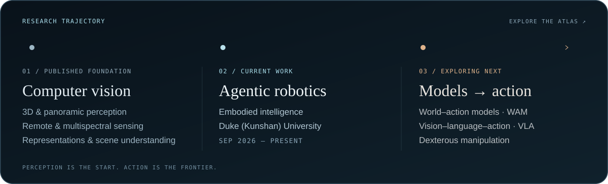
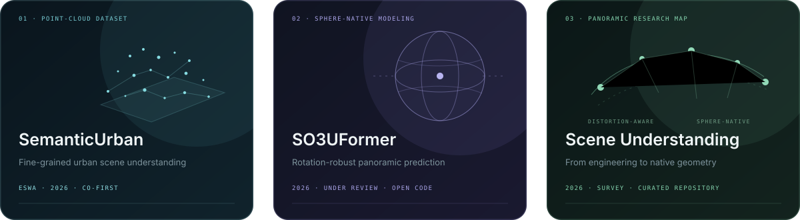

  

  <a href="https://zhuqinfeng1999.github.io/"><b>Website ↗</b></a>&nbsp;&nbsp;·&nbsp;&nbsp;
  <a href="https://zhuqinfeng1999.github.io/research/"><b>Research Atlas ↗</b></a>&nbsp;&nbsp;·&nbsp;&nbsp;
  <a href="https://zhuqinfeng1999.github.io/publications/"><b>Publications ↗</b></a>&nbsp;&nbsp;·&nbsp;&nbsp;
  <a href="https://scholar.google.com.hk/citations?user=gG81gcUAAAAJ"><b>Google Scholar ↗</b></a>&nbsp;&nbsp;·&nbsp;&nbsp;
  <a href="https://zhuqinfeng1999.github.io/assets/docs/Qinfeng_Zhu_CV.pdf"><b>CV · September 2026 ↓</b></a>

## Hello — I’m Qinfeng.

I am currently a **research intern in embodied intelligence** at **[Duke University (based Kunshan)](https://www.dukekunshan.edu.cn/)** (**September 2026–present**), working with **[Prof. Kaizhu Huang](https://sites.google.com/view/kaizhu-huang-homepage)** on **agentic robotics**.

I am a Ph.D. student at the **University of Liverpool** and **Xi’an Jiaotong-Liverpool University**, advised by **[Dr. Lei Fan](https://scholar.xjtlu.edu.cn/en/persons/LeiFan)** and **[Dr. Anh Nguyen](https://www.csc.liv.ac.uk/~anguyen/)**. I received an MRes in Computer Science from the University of Liverpool in 2023.

My research is moving **from computer vision to embodied intelligence**: from understanding visual scenes to building agents that reason and act in the physical world. My work in **3D point clouds, panoramic vision, remote sensing and multispectral perception** provides the visual and geometric foundation for this next chapter.

> **2026** · Open to research internship opportunities. 
> **2027** · Seeking full-time research opportunities in academia or industry after graduation.

## From perception to action

I am exploring **world–action models (WAM)**, **vision–language–action (VLA)** and **dexterous manipulation**: how agents anticipate physical consequences, ground instructions in action, and coordinate precise hand–object interaction. These are developing research directions; the publications below document my computer-vision foundations.

<a href="https://zhuqinfeng1999.github.io/explorer/"><b>Explore the interactive robotics studies ↗</b></a> Robotic arm · Dexterous hand · VLA-style terminal · Idealized world dynamics Illustrative scenes, not live learned policies or experimental results.

## Selected research · the perception foundation

1. **[Towards accurate urban scene understanding using point clouds: The SemanticUrban dataset](https://www.sciencedirect.com/science/article/pii/S0957417426018610)** 
   *Expert Systems with Applications*, 2026 · **Co-first author** · [Dataset](https://zhuqinfeng1999.github.io/SemanticUrban/) · [Code](https://github.com/YuanFangFF/SemanticUrban)

2. **[SO3UFormer: Learning Intrinsic Spherical Features for Rotation-Robust Panoramic Dense Prediction](https://arxiv.org/abs/2602.22867)** 
   Under review, 2026 · Sphere-native panoramic modeling · [Project](https://zhuqinfeng1999.github.io/projects/so3uformer/) · [Code](https://github.com/zhuqinfeng1999/SO3UFormer)

3. **[Panoramic Scene Understanding: A Survey from Distortion-Aware Engineering to Sphere-Native Modeling](https://arxiv.org/abs/2606.27745)** 
   Under review, 2026 · A structured map of panoramic perception · [Research map](https://zhuqinfeng1999.github.io/projects/panoramic-scene-understanding/) · [Repository](https://github.com/zhuqinfeng1999/Awesome-Panoramic-Scene-Analysis)

4. **[ClassWise-CRF: Category-Specific Fusion for Enhanced Semantic Segmentation of Remote Sensing Imagery](https://doi.org/10.1016/j.neunet.2025.108485)** 
   *Neural Networks*, 2026 · Category-aware expert fusion · [Code](https://github.com/zhuqinfeng1999/ClassWise-CRF)

5. **[SwinMamba: A Hybrid Local-Global Mamba Framework for Enhancing Semantic Segmentation of Remotely Sensed Images](https://www.sciencedirect.com/science/article/pii/S105120042600148X)** 
   *Digital Signal Processing*, 2026 · Local-global state-space modeling · [DOI](https://doi.org/10.1016/j.dsp.2026.106029)

<a href="https://zhuqinfeng1999.github.io/publications/"><b>Browse all 16 publications →</b></a>

## Open research artifacts

| Artifact | Research scope |
| :--- | :--- |
| [`SO3UFormer`](https://github.com/zhuqinfeng1999/SO3UFormer) | Sphere-native panoramic dense prediction `360° vision` · `geometry` |
| [`Panoramic Scene Analysis`](https://github.com/zhuqinfeng1999/Awesome-Panoramic-Scene-Analysis) | Curated taxonomy and literature map `survey` · `research map` |
| [`SemanticUrban`](https://github.com/YuanFangFF/SemanticUrban) | High-resolution urban terrestrial point clouds `dataset` · `3D perception` |
| [`ClassWise-CRF`](https://github.com/zhuqinfeng1999/ClassWise-CRF) | Category-specific expert-network fusion `remote sensing` · `segmentation` |
| [`IndoorMS`](https://github.com/zhuqinfeng1999/IndoorMS) | Indoor multispectral semantic segmentation `dataset` · `multimodal` |
| [`WasteMS`](https://github.com/zhuqinfeng1999/WasteMS) | Lakeside-waste multispectral benchmark `environment` · `multispectral` |
| [`Samba`](https://github.com/zhuqinfeng1999/Samba) · [`Seg-LSTM`](https://github.com/zhuqinfeng1999/Seg-LSTM) | State-space and recurrent models for Earth observation `Mamba` · `xLSTM` |

**[Spatialfolio — Interactive Academic Portfolio](https://github.com/zhuqinfeng1999/interactive-academic-portfolio)** · My reusable academic website template, with Embodied and Perception editions. [See it in action ↗](https://zhuqinfeng1999.github.io/)

## Let’s connect

I welcome collaborations and opportunities in **embodied intelligence, agentic robotics, WAM, VLA and dexterous manipulation**, as well as computer vision that supports reliable perception and physical interaction.

  <a href="mailto:zhuqinfeng1999@gmail.com"><b>Email</b></a>&nbsp;&nbsp;·&nbsp;&nbsp;
  <a href="https://www.linkedin.com/in/qinfengzhu/"><b>LinkedIn</b></a>&nbsp;&nbsp;·&nbsp;&nbsp;
  <a href="https://orcid.org/0009-0002-4847-3555"><b>ORCID</b></a>&nbsp;&nbsp;·&nbsp;&nbsp;
  <a href="https://www.researchgate.net/profile/Qinfeng-Zhu-3"><b>ResearchGate</b></a>

